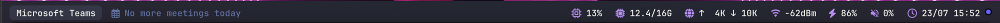

# sketchybar

My personal [SketchyBar](https://github.com/FelixKratz/SketchyBar) configuration for macOS. A custom top bar with app focus, calendar, media, and system stats, themed with Dracula.



## Layout

**Left**
- Focused-app pill
- Next calendar meeting today (click to join the Teams call)
- Now playing, scrolling title

**Right** (rightmost first)
- Clock (click opens Calendar)
- Battery
- Volume (scroll to change)
- Wi-Fi signal in dBm
- Network throughput (up/down)
- RAM
- CPU
- Mic / camera in-use indicators

## Documentation

Full docs live in [`docs/`](docs/index.md), organised by [Diátaxis](https://diataxis.fr):

- [Install and run the bar](docs/tutorials/10-install.md) walks a fresh machine from zero.
- [How-to guides](docs/how-to/index.md) cover adding an item, switching themes, and fixing the mic/camera watcher.
- [Reference](docs/reference/index.md) lists every item, runtime file, dependency, and icon constant.
- [Explanation](docs/explanation/index.md) records which macOS API each workaround replaces.

## Quick start

```sh
brew tap FelixKratz/formulae
brew install sketchybar ical-buddy nowplaying-cli
brew install --cask font-jetbrains-mono-nerd-font sf-symbols

git clone git@github.com:Just-Martin-Really/sketchybar.git ~/.config/sketchybar
brew services start sketchybar
```

Apply later changes with `sketchybar --reload` rather than restarting the service. Full setup, including the two macOS permissions the media item needs, is in the [install tutorial](docs/tutorials/10-install.md).

## File layout

```text
.
├── sketchybarrc        # main config, sourced on every reload
├── icons.sh            # Nerd Font glyph constants (bash ANSI-C escapes)
├── assets/
│   └── screenshot.png
├── docs/               # Diátaxis documentation
│   ├── tutorials/
│   ├── how-to/
│   ├── reference/
│   └── explanation/
├── plugins/            # per-item scripts, invoked with $NAME / $SENDER / $INFO
│   ├── avwatch.sh          # background log-stream daemon for mic/cam indicators
│   ├── battery.sh
│   ├── camera.sh
│   ├── clock.sh
│   ├── cpu.sh
│   ├── front_app.sh
│   ├── media.sh            # track name via MediaRemote, with a browser fallback
│   ├── media_click.sh
│   ├── mic.sh
│   ├── network.sh          # throughput, diffs netstat against a /tmp state file
│   ├── next_meeting.sh     # next timed event today via icalBuddy
│   ├── next_meeting_join.sh# opens the Teams join link of the current/next event
│   ├── ram.sh
│   ├── volume.sh           # click opens Sound settings, scroll changes volume
│   └── wifi.sh
└── themes/
    ├── dracula.sh      # active theme
    └── tokyonight.sh   # alternate
```

## Notes

Most items have an unusual shape because the obvious approach stopped working on modern macOS. [Explanation](docs/explanation/index.md) covers each one. The short version:

- **Glyphs** live in `icons.sh` as `$'\uXXXX'` escapes. Tools strip raw Private Use Area characters silently, leaving no error and no visible diff.
- **Now playing** reads MediaRemote through `nowplaying-cli`. Firefox publishes only a placeholder title, so its track comes from the window title.
- **Mic / camera indicators** cannot be polled on Apple Silicon. `avwatch.sh` streams Control Center's privacy-indicator log and triggers `mic_change` / `camera_change`.
- **Next meeting** reads macOS Calendar via `icalBuddy`. Outlook and M365 events appear once the Exchange account is added to Internet Accounts.
- **Wi-Fi** reports RSSI from `system_profiler`. The `airport` binary was removed in macOS 14.4, and `wdutil` requires sudo.
